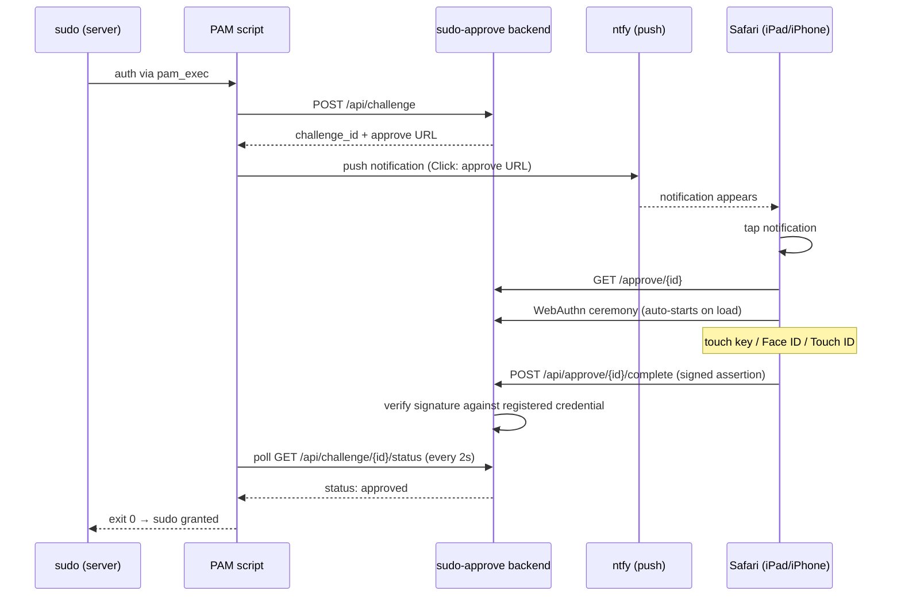

# sudo-approve

Approve `sudo` remotely with a physical FIDO2 security key, Face ID, or Touch ID
— no app, no subscription, no code to type. Tap a push notification, touch your
key, done.

## Why

I wanted to approve `sudo` on my homelab servers from my iPad using the same
FIDO2 hardware key I already use for local login — ideally without typing a
TOTP code every time I'm away from the machine. The commercial paths
(`pam_rssh` + SSH agent forwarding through a terminal app, various "FIDO2 SSH
client" apps) turned out to be either paywalled, undocumented for this exact
combination, or both.

Turns out Safari on iOS/iPadOS already speaks WebAuthn natively — the same
standard behind FIDO2 and Passkeys — so a self-hosted web page can talk
directly to a security key or Face ID/Touch ID with zero extra software. This
is that page, plus the glue to hook it into PAM.

## How it works



If anything fails or times out (backend unreachable, notification never
tapped, key not touched in time), the PAM script exits non-zero and PAM falls
through to the next configured method — TOTP, then password. **This is never
the only way in.** It's a convenience layer on top of whatever you already
have, not a replacement.

## Components

- **`app.py`** — FastAPI backend, WebAuthn server (`python-fido2`), SQLite
  storage. Runs once, centrally (I run it on my always-on homelab server).
- **`pam/sudo-remote-approve.sh`** — the `pam_exec` script deployed to every
  machine you want this on. Creates a challenge, sends the push, polls for
  approval.
- **`docker-compose.yml` / `Dockerfile`** — runs the backend as a non-root
  user in a container.

## Setup

### 1. Backend

```bash
cp .env.example .env   # set SETUP_TOKEN to a long random value
docker compose up -d --build
```

Put it behind a reverse proxy with a real TLS certificate — WebAuthn requires
HTTPS (or localhost). Set `RP_ID` to that domain.

Restrict access at the network level (reverse proxy IP allowlist, VPN-only,
whatever fits your setup) — `SETUP_TOKEN` gates the registration endpoint
itself, but the whole thing is meant to sit inside a trusted network
boundary, not be exposed to the open internet.

### 2. Register a credential

Visit `https://your-domain/register?token=<SETUP_TOKEN>`, name the
credential, and follow the browser prompt. Repeat for every key/device you
want to be able to approve with (I registered my physical key, Face ID, and
Touch ID — any of the three can approve).

### 3. Push notifications

The script expects an `ntfy` (or compatible) push endpoint. Set the topic URL
and an auth token in whatever credentials file
`pam/sudo-remote-approve.sh` reads — adjust the script for your own notifier
if you use something else.

### 4. Wire it into PAM

Add a line to `/etc/pam.d/sudo`, positioned wherever you want it tried
relative to your other `auth` methods (`sufficient` control, so success
grants immediately and failure falls through):

```
auth  sufficient  pam_exec.so seteuid /usr/local/bin/sudo-remote-approve.sh
```

**Back up `/etc/pam.d/sudo` before touching it.** A broken PAM stack can lock
you out of `sudo` entirely.

## Security model

Real WebAuthn/FIDO2 challenge-response — a fresh random challenge per
request, verified against the public key registered for that credential. Not
a bearer-token push button (rejected that approach early on: it's vulnerable
to MFA-fatigue-style attacks, the kind behind the 2022 Uber breach — an
attacker spamming approval requests until someone taps "yes" by reflex).

`/register` is gated by `SETUP_TOKEN` so registering a new credential
requires knowing that token, not just being on the right subnet.

This is a homelab project, not an audited security product. Read the code
before trusting it with anything that matters.

## The debugging story

The build itself went fine. Getting it to work *reliably* was a proper
detective story, and the ending is the best part: after a security review,
a dependency upgrade, and a deep dive into PAM internals, the actual bug was
fixed by turning Wi-Fi off and on again.

In order:

1. **"It's asking for a code or password."** First real end-to-end attempt
   just skipped straight past the new step. Turned out `pam_exec`'s
   `seteuid` option runs the script as `PAM_USER` — which for a `sudo` auth
   transaction is `root`, not the invoking user. `$HOME` was unset, so
   `$HOME/.config/ntfy/credentials.env` resolved to nothing and the script
   died before it even tried the network. Fix: hardcode the path.

2. **A "skip with a keypress" feature that made things worse, not better.**
   Wanted a way to bail out of the 85-second wait early by pressing any key.
   Implemented it with `read -t 2 < /dev/tty`. In the `pam_exec` context,
   `/dev/tty` isn't a usable terminal, so `read` failed *instantly* instead
   of timing out — the entire 85-second polling loop burned through in
   under two seconds of wall-clock time, with zero real chance to approve
   anything. Reverted to a plain `sleep`.

3. **`ntfy` push silently failing.** The credentials file has
   `NTFY_URL=http://127.0.0.1:8480` — correct for scripts running *on* the
   ntfy host, meaningless on a different machine, where `127.0.0.1` means
   itself. Hardcoded the public HTTPS URL in the script instead.

4. **Going public forced a second look, which was worth it.** Before
   opening the repo up, a proper re-read turned up a real gap:
   `/register` had no auth of its own, just the network-level IP allowlist
   — anyone on the LAN could have registered their own credential and
   granted themselves sudo-approval power. Added a `SETUP_TOKEN` gate.
   `pip-audit` on the same pass found 16 known CVEs sitting in `cryptography`
   and `starlette` (transitive deps of `fido2`/`fastapi`) — pinned versions
   were just old. Fixing it meant a `fido2` major-version bump (1.x → 2.x),
   which dropped a feature flag the code depended on
   (`webauthn_json_mapping`); everything else in the API was unchanged.
   Re-verified the whole flow end-to-end afterward before trusting it.

5. **"Notification shows up, app shows nothing."** Server-side, every
   message was there, full content, no exceptions — checked the delivery
   database directly. Root cause: self-hosted `ntfy` can't talk to Apple's
   push service directly, so it forwards a *contentless* trigger through
   `ntfy.sh` for privacy, and the app is supposed to fetch the real message
   from the self-hosted server afterward. During a burst of rapid testing
   (many approvals in a few minutes), iOS started throttling that
   background fetch — the banner showed up, the content didn't. Spacing
   requests out made it disappear.

6. **The actual final bug: "Safari can't find the server."** DNS. The
   domain only exists as a local Pi-hole record (never went into public
   DNS on purpose), and the phone had it stuck on a stale/negative lookup
   — quietly resolved by leaving it. Toggling Wi-Fi off and on forced a
   fresh DNS query, and the entire flow worked cleanly on the very next
   try. All that debugging, and the fix was the oldest trick in IT support.

## Known limitations

- No cleanup of very old, never-approved challenge rows beyond a 24h purge
  on each new request — fine for personal use, would need real housekeeping
  at any scale.
- The backend is a single point of failure for the *convenience* path, by
  design — see the fallback behavior above.
